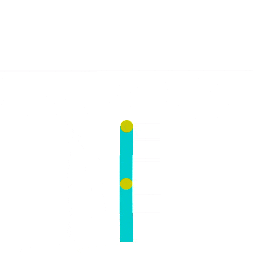
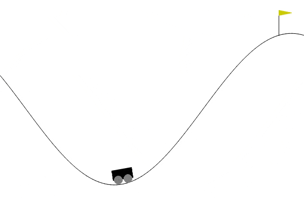

# Reinforce-lib Zoo
Model zoo of pre-trained agents for [reinforce-lib](https://github.com/Luca96/reinforce-lib).

---

## Models

Both agent's weights (under `\weights`) and the code (`code.py`) to reproduce them, is provided.

### Classic Control

**CartPole-v1**:

* DQN + PER
* PPO

**Acrobot-v1**:

* Double-DQN

**MountainCarContinuous-v0**:

* SAC

**LunarLanderContinuous-v2**:

* TD3

---

### Continuous Control (PyBullet)

**Hopper** (pyBullet):

* TD3

---

