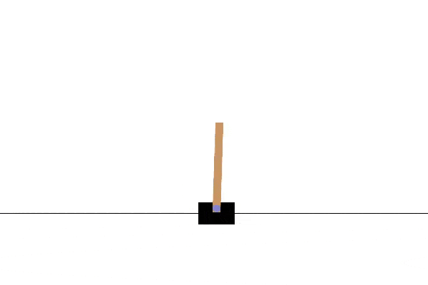
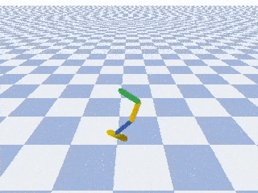
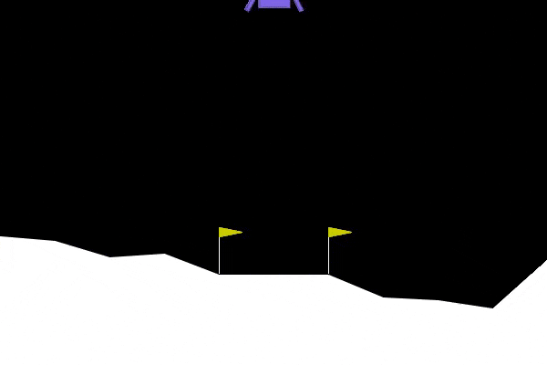

# Reinforce-lib Zoo
Model zoo of pre-trained agents for [reinforce-lib](https://github.com/Luca96/reinforce-lib).

---

## Models

Both agent's weights (under `\weights`) and the code (`code.py`) to reproduce them, is provided.

  

    
  

  

    
  

  

    
  

 

**CartPole-v1**:

* [DQN + PER](https://github.com/Luca96/reinforcelib-zoo/zoo/cartpole-v1/DQN-PER)
* [PPO](https://github.com/Luca96/reinforcelib-zoo/zoo/cartpole-v1/PPO)

**Hopper** (pyBullet):

* [TD3](https://github.com/Luca96/reinforcelib-zoo/zoo/hopper/TD3)

**LunarLanderContinuous-v2**:

* [TD3](https://github.com/Luca96/reinforcelib-zoo/zoo/lunar-lander-continuous-v2/TD3)

---

